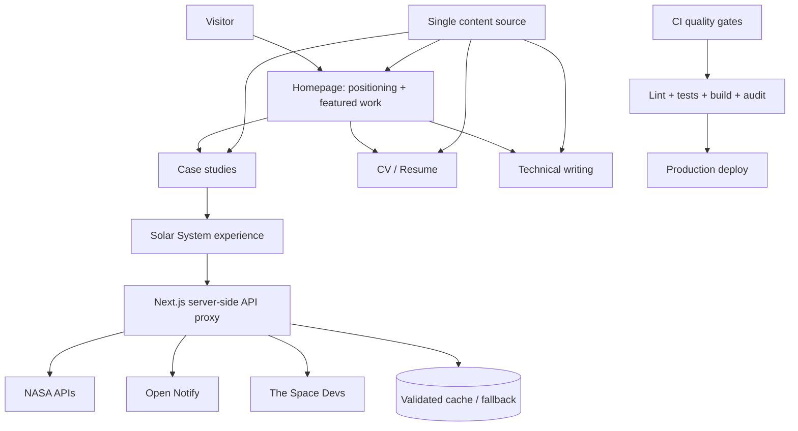

# Kế hoạch nâng cấp kỹ thuật và sản phẩm

**Dự án:** PersonalHobbies / MTL Studio

**Ngày audit:** 2026-09-18

**Trạng thái:** Tài liệu bàn giao cho đội triển khai

**Phạm vi:** Product positioning, UI/UX, accessibility, SEO, hiệu năng, WebGL/R3F, API, bảo mật, kiểm thử và vận hành

---

## 1. Mục tiêu

Mục tiêu của đợt nâng cấp là chuyển dự án từ một demo kỹ thuật nhiều hiệu ứng thành một portfolio cá nhân có thể dùng trong tuyển dụng, hợp tác và giới thiệu năng lực chuyên môn.

Sau khi hoàn thành, website phải đáp ứng đồng thời bốn yêu cầu:

1. Người xem hiểu được Minh Tú là ai, làm tốt việc gì và nên xem dự án nào trong 10 giây đầu.
2. Mọi tuyên bố về năng lực hoặc kết quả dự án đều có ngữ cảnh và bằng chứng phù hợp.
3. Trải nghiệm chính hoạt động tốt trên mobile, thiết bị cấu hình thấp, bàn phím và screen reader.
4. Build, lint, security audit và smoke test được tự động hóa và đủ ổn định để triển khai production.

### 1.1. Định vị đề xuất

Thông điệp thống nhất cho toàn bộ website:

> Full-stack engineer xây dựng trải nghiệm tương tác, dữ liệu thời gian thực và hệ thống nhúng.

Solar System 3D nên là flagship project chứng minh năng lực WebGL, dữ liệu thời gian thực và tối ưu frontend. IoT/embedded là trụ cột thứ hai. Các dự án CRUD hoặc bài tập nhỏ nên nằm trong archive thay vì cạnh tranh thị giác với flagship project.

### 1.2. Ngoài phạm vi

- Không viết lại toàn bộ dự án bằng framework khác.
- Không xây CMS nếu chưa có nhu cầu cập nhật nội dung thường xuyên.
- Không thêm hiệu ứng mới trước khi hoàn tất performance và accessibility budget.
- Không giữ số liệu thành tích không thể xác minh chỉ để làm nội dung trông mạnh hơn.

---

## 2. Bằng chứng audit hiện tại

Audit được thực hiện trên branch `main`, commit `cd671dd`, bằng build production, ESLint, npm audit và browser automation ở viewport desktop 1440×900 và mobile 390×844.

| Hạng mục | Kết quả hiện tại |
|---|---|
| Production build | Pass khi môi trường build có thể tải Google Fonts |
| ESLint | Fail: 14 errors, 3 warnings |
| Production dependency audit | 6 vulnerabilities: 1 critical, 3 high, 2 moderate |
| Trang chủ | Khoảng 36 MB frame WebP; 361 frame được preload đồng thời |
| Lần đo trang chủ | 227 ảnh và khoảng 15,75 MB đã tải trước thời điểm chụp |
| Solar System | Khoảng 7,01 MB transfer; khoảng 15,26 MB decoded resources |
| Public assets | Khoảng 42,86 MB |
| Desktop routes | Không có horizontal overflow trong sáu route được kiểm tra |
| Mobile routes | Không có horizontal overflow, nhưng có overlap và vấn đề kích thước chữ/controls |
| NASA APOD | Trả HTTP 500 khi chạy bằng `DEMO_KEY` |
| Tests/CI | Không có test của ứng dụng và không có GitHub Actions |
| SEO | Thiếu canonical, OG/Twitter images, sitemap, robots và structured data |

Các route đã kiểm tra:

- `/`
- `/portfolio`
- `/cv`
- `/blog`
- `/blog/thiet-ke-apple-toi-gian`
- `/portfolio/solar-system`

---

## 3. Kiến trúc mục tiêu



Nguyên tắc kiến trúc:

- Nội dung có một nguồn dữ liệu duy nhất; page, navigation và API không giữ các bản sao khác nhau.
- API bên thứ ba đi qua server-side proxy khi có API key, quota, CORS hoặc nhu cầu cache/fallback.
- Animation và WebGL là progressive enhancement. Nội dung cốt lõi vẫn đọc và điều hướng được khi animation tắt hoặc WebGL không khả dụng.
- Mobile không mặc định nhận toàn bộ chất lượng đồ họa của desktop.

---

## 4. Thứ tự triển khai bắt buộc

Không triển khai theo thứ tự file. Thực hiện theo dependency và mức rủi ro sau:

1. **PR 1 — Security và baseline quality:** `SEC-*`, `QA-*`.
2. **PR 2 — Trust và content correctness:** `TRUST-*`, `CONTENT-001`.
3. **PR 3 — SEO và content architecture:** `SEO-*`, `CONTENT-002`.
4. **PR 4 — Homepage performance:** `PERF-001`, `PERF-002`, `MOTION-001`.
5. **PR 5 — WebGL performance và API:** `R3F-*`, `API-*`.
6. **PR 6 — Accessibility/navigation:** `A11Y-*`, `NAV-*`.
7. **PR 7 — Portfolio redesign và case studies:** `UX-*`, `CONTENT-003`.
8. **PR 8 — Observability và release gate:** `OPS-*`.

Mỗi PR phải độc lập, có before/after evidence và không trộn refactor ngoài phạm vi.

---

## 5. P0 — Phải sửa trước khi quảng bá website

### SEC-001 — Nâng cấp Next.js và dependencies có advisory

**Hiện trạng**

- `next@16.2.7` có advisory mức critical.
- `npm audit --omit=dev` báo 6 lỗ hổng production.
- npm đề xuất bản vá Next.js `16.3.5` tại thời điểm audit.

**File liên quan**

- `package.json`
- `package-lock.json`

**Hướng triển khai**

1. Nâng Next.js và `eslint-config-next` cùng minor version đã vá.
2. Chạy `npm audit --omit=dev` sau khi cập nhật.
3. Kiểm tra breaking/deprecation notes trong tài liệu đi kèm phiên bản Next.js đang cài.
4. Chạy lint, production build và browser smoke test cho toàn bộ route.
5. Không dùng `npm audit fix --force` nếu chưa review diff dependency.

**Acceptance criteria**

- Không còn vulnerability critical hoặc high trong production dependencies.
- `npm run build` pass.
- Sáu route chính trả HTTP 200 và không có hydration error.

---

### QA-001 — Đưa lint về trạng thái pass

**Hiện trạng**

- 14 lỗi `react/no-unescaped-entities` trong trang chủ.
- 3 warning `@next/next/no-img-element` trong UI dữ liệu không gian.

**Hướng triển khai**

- Sửa JSX text bằng ký tự Unicode phù hợp hoặc entity hợp lệ.
- Với ảnh remote từ NASA/Space Devs, chọn một trong hai phương án:
  - cấu hình `next/image` remote patterns và kích thước rõ ràng;
  - giữ `` có lý do được ghi chú và disable rule tại dòng cụ thể.
- Không disable toàn cục rule chỉ để làm CI xanh.

**Acceptance criteria**

- `npm run lint` trả exit code 0.
- Không thêm eslint disable ở cấp project nếu không có ADR hoặc giải thích trong PR.

---

### TRUST-001 — Sửa toàn bộ link và placeholder sai

**Hiện trạng**

- Footer trỏ GitHub và LinkedIn về homepage của dịch vụ.
- Mega menu dùng `contact@example.com`.
- CV hiển thị LinkedIn cá nhân nhưng href trỏ `linkedin.com`.
- Menu ghi “Hệ Mặt Trời 2D” trong khi route là mô phỏng 3D.
- `/cv#experience` và `/cv#skills` không có target ID.

**File liên quan**

- `src/app/layout.js`
- `src/app/components/GlobalHeader.js`
- `src/app/cv/page.js`

**Hướng triển khai**

- Tạo một object `SITE_CONFIG` chứa name, email, GitHub, LinkedIn, location và external profile URLs.
- Dùng config này trong header, footer, CV và metadata.
- Thêm ID semantic cho các section CV hoặc bỏ hash links.
- Chạy link checker cho internal links.

**Acceptance criteria**

- Không còn `example.com`, `https://github.com` chung chung hoặc `https://linkedin.com` chung chung.
- Mọi internal hash link cuộn đến đúng section.
- Tên sản phẩm nhất quán giữa navigation, card và page title.

---

### TRUST-002 — Xác minh nội dung CV và số liệu dự án

**Hiện trạng**

Nội dung đang có nhiều claim định lượng và chứng chỉ nhưng không có nguồn hoặc liên kết xác minh, ví dụ P95 dưới 1,2 giây, perceived load cải thiện 40%, heap giảm 30%, IELTS/AWS/Google/Meta certificate.

**Hướng triển khai**

Đối với từng claim, chọn một trong ba cách:

1. Gắn benchmark/report/repository/certificate URL.
2. Bổ sung điều kiện đo và phạm vi: thiết bị, dataset, before/after, công cụ.
3. Nếu không thể xác minh, đổi sang mô tả định tính chính xác.

Không được tự tạo certificate URL, benchmark hoặc số liệu mới.

**Acceptance criteria**

- Mọi số liệu phần trăm/P95 có nguồn hoặc phương pháp đo.
- Chứng chỉ quan trọng có credential link nếu người sở hữu muốn công khai.
- Nội dung tiếng Việt và tiếng Anh truyền đạt cùng một mức độ claim.

---

### API-001 — Không để API key và quota ở client

**Hiện trạng**

- NASA key được đọc từ `NEXT_PUBLIC_NASA_API_KEY`.
- Ba NASA request được preload ngay khi vào Solar System.
- APOD với `DEMO_KEY` trả 500 trong audit.
- Launch API được gọi trực tiếp từ browser.

**File liên quan**

- `src/app/components/3d/HologramPanel.js`
- `src/app/components/3d/LaunchDashboard.js`
- `src/app/api/iss-now/route.js`
- `src/app/api/astros/route.js`

**Hướng triển khai**

1. Đổi API key sang server-only env `NASA_API_KEY`.
2. Tạo route handler server-side cho APOD, DONKI, Mars và launch data.
3. Chỉ gọi dữ liệu hành tinh sau khi người dùng chọn hành tinh hoặc mở dashboard.
4. Thêm timeout bằng `AbortSignal.timeout()` hoặc `AbortController`.
5. Kiểm tra `response.ok` trước khi parse JSON.
6. Validate response bằng schema nhỏ, chỉ trả field UI cần.
7. Dùng cache/revalidation phù hợp từng nguồn.
8. Trả stale fallback nếu upstream tạm thời lỗi.

**Acceptance criteria**

- Không có secret trong client bundle hoặc request URL từ browser.
- Không gọi APOD/DONKI/Mars trước khi tính năng tương ứng được mở.
- Upstream 429/500 không làm UI treo vô hạn.
- Error UI nêu được trạng thái và cho phép thử lại.

---

## 6. P1 — Hiệu năng và ổn định trải nghiệm chính

### PERF-001 — Thay cơ chế preload 361 frame trang chủ

**Hiện trạng**

- 361 WebP, tổng khoảng 36 MB, được tạo `Image` và tải song song.
- Mỗi frame 1280×720.
- Toàn bộ sequence chỉ hoạt động sau khi tất cả frame đã hoàn tất hoặc lỗi.
- Mobile nhận cùng payload desktop.
- Trang có spacer cố định 3.850 px.

**Rủi ro**

- LCP và time-to-content kém trên mạng di động.
- Decode bitmap có thể gây memory pressure nghiêm trọng.
- Hàng trăm request cạnh tranh với CSS, JS và font.
- Người dùng phải cuộn lâu trước khi thấy thông tin nghề nghiệp.

**Phương án ưu tiên**

1. Chuyển sequence thành video WebM/AV1 có poster.
2. Dùng media query/source phù hợp desktop và mobile.
3. Chỉ autoplay muted nếu không vi phạm reduced motion/data saver.
4. Nếu bắt buộc scroll-scrub chính xác, tải frame theo chunk:
   - frame đầu tiên: priority;
   - frame 1–30: sau first paint;
   - phần còn lại: theo scroll direction và idle time;
   - giới hạn số request đồng thời;
   - giải phóng bitmap xa viewport bằng `ImageBitmap.close()` nếu dùng ImageBitmap.

**Yêu cầu UX**

- Tên, vai trò và CTA phải có trong viewport đầu hoặc xuất hiện sau không quá một interaction ngắn.
- Có nút “Bỏ qua phần mở đầu” khi sequence dài hơn một viewport.
- Mobile có thể dùng poster + transition ngắn thay cho full sequence.

**Acceptance criteria**

- Trang chủ mobile initial transfer dưới 2 MB trước interaction.
- Không preload 361 ảnh đồng thời.
- Nội dung chính xuất hiện trong DOM và có thể truy cập khi JS/animation lỗi.
- Không có layout trống hàng nghìn pixel khi reduced motion bật.

---

### PERF-002 — Sửa cache strategy cho animation assets

**Hiện trạng**

Frame có header `immutable` một năm nhưng filename chỉ là số thứ tự, không chứa content hash.

**Hướng triển khai**

- Nếu tiếp tục dùng frame, thêm version/hash vào folder hoặc filename.
- Chỉ dùng `immutable` cho URL thay đổi khi nội dung thay đổi.
- Nếu dùng video, tạo URL versioned và poster versioned.

**Acceptance criteria**

- Deploy asset mới không bị cache cũ giữ lại.
- Cache hit vẫn cao đối với asset không đổi.

---

### MOTION-001 — Sửa lifecycle của Lenis/GSAP và reduced motion

**Hiện trạng**

`gsap.ticker.add()` và `remove()` nhận hai function object khác nhau, nên cleanup không xóa callback đã đăng ký. Earth Hero cũng gọi `ScrollTrigger.getAll().forEach(kill)`, có thể xóa trigger không thuộc component.

**Hướng triển khai**

- Giữ một callback `raf` có identity ổn định và dùng cùng reference khi add/remove.
- Lưu timeline/trigger instance trong ref và chỉ kill instance đó.
- Không khởi tạo Lenis khi `prefers-reduced-motion: reduce`.
- Tôn trọng `navigator.connection.saveData` nếu khả dụng.

**Acceptance criteria**

- Route transition/remount không làm tăng số GSAP ticker callbacks.
- Reduced motion loại bỏ smooth scroll, bounce, scanline và scroll-scrub dài.
- Không có state update sau khi Earth Hero unmount.

---

### R3F-001 — Adaptive rendering cho Solar System

**Hiện trạng**

- Skybox 8192×4096.
- Có cả skybox và 5.000 Drei Stars.
- Antialias, logarithmic depth buffer và ba postprocessing pass luôn bật.
- Không giới hạn DPR theo profile thiết bị.

**Hướng triển khai**

Tạo quality profile:

| Profile | DPR | Background | Postprocessing | Texture target |
|---|---:|---|---|---|
| High desktop | 1–1.5 | Skybox hoặc Stars | Bloom + vignette | 2K, skybox tối đa 4K |
| Standard | 1 | Một star system | Bloom nhẹ | 1K–2K |
| Mobile/low | 0.75–1 | Stars giảm count | Không chromatic aberration | 512–1K |

Profile có thể chọn dựa trên viewport, `deviceMemory`, DPR và renderer capability. Luôn cho phép override thủ công.

**Acceptance criteria**

- Mobile không tải skybox 8K.
- Mobile không bật chromatic aberration mặc định.
- UI giữ mức tương tác ổn định trên thiết bị tầm trung; mục tiêu tối thiểu 30 FPS trong thao tác camera.
- WebGL context không mất trong smoke test điều hướng vào/ra route nhiều lần.

---

### R3F-002 — Loại bỏ allocations trong render loop

**Hiện trạng**

- `new THREE.Vector3()` trong `CameraController.useFrame`.
- `new THREE.Vector3()` trong `ISSMarker.useFrame`.
- `new THREE.Color()` được tạo trong JSX render của Sun.
- Orbit points được tạo trong render cho từng planet.

**Hướng triển khai**

- Hoist vector/color tạm vào `useRef` hoặc module scope an toàn.
- Memoize orbit points theo bán kính.
- Memoize material color.
- Dispose geometry tùy biến khi unmount nếu không do R3F quản lý tự động.

**Acceptance criteria**

- Không có `new THREE.*` trong bất kỳ `useFrame` callback nào.
- React rerender không tái tạo orbit point arrays nếu bán kính không đổi.
- Heap snapshot không tăng liên tục sau nhiều lần mở/đóng route.

---

### R3F-003 — Quản lý render loop và trạng thái tab

**Hướng triển khai**

- Dừng hoặc giảm update khi `document.visibilityState === "hidden"`.
- Không polling ISS khi route không visible.
- Throttle telemetry UI độc lập với frame loop.
- Cân nhắc loop 30 FPS trên mobile; giữ simulation time theo delta để không sai quỹ đạo.

**Acceptance criteria**

- Hidden tab không tiếp tục polling mỗi 5 giây.
- CPU usage giảm rõ rệt khi tab background.
- Time scale vẫn đúng sau khi tab quay lại foreground.

---

## 7. P1 — Accessibility và navigation

### A11Y-001 — Keyboard, focus và semantic navigation

**Hiện trạng**

- Không có style `:focus-visible`.
- Mega menu phụ thuộc `onMouseEnter`.
- Mobile menu thiếu `aria-expanded`, Escape handling và scroll lock.
- Không đánh dấu route hiện tại bằng `aria-current`.

**Hướng triển khai**

- Thêm focus ring có contrast tốt cho link, button, range và card action.
- Mega menu mở bằng focus/click ngoài hover.
- Button menu có `aria-expanded`, `aria-controls` và label theo trạng thái.
- Escape đóng menu; focus quay lại trigger.
- Khi mobile menu mở, khóa scroll nền và không để focus đi vào nội dung phía sau.
- Dùng `aria-current="page"` cho route hiện tại.

**Acceptance criteria**

- Toàn bộ navigation dùng được chỉ bằng keyboard.
- Không có keyboard trap.
- Focus luôn nhìn thấy.
- Mobile menu đóng bằng Escape và khôi phục focus đúng vị trí.

---

### A11Y-002 — Solar System có lớp tương tác DOM tương đương

**Hiện trạng**

Các hành tinh chỉ có thể chọn bằng pointer trên canvas. Range time scale không có accessible name.

**Hướng triển khai**

- Thêm danh sách/select DOM cho Mặt Trời, hành tinh và ISS.
- Khi chọn từ danh sách, cập nhật cùng Zustand action với click canvas.
- Gắn `<label>` hoặc `aria-label` cho range.
- Hiển thị giá trị time scale bằng `output` hoặc live region không quá ồn.
- Cung cấp fallback mô tả khi WebGL không khả dụng.

**Acceptance criteria**

- Người dùng keyboard có thể chọn mọi thiên thể và đọc cùng thông tin.
- Screen reader đọc được tên và giá trị range.
- Canvas có accessible description phù hợp, không thay thế toàn bộ nội dung semantic.

---

### A11Y-003 — Launch Dashboard thành dialog đúng chuẩn

**Hướng triển khai**

- Dùng semantic dialog hoặc `role="dialog"`, `aria-modal="true"`, `aria-labelledby`.
- Focus vào heading/close button khi mở.
- Trap focus trong dialog.
- Escape đóng dialog và trả focus về nút “Lịch phóng”.
- Tabs dùng `role="tablist"`, `role="tab"`, `aria-selected` và keyboard arrow navigation.
- Background không nhận pointer/focus khi dialog mở.

**Acceptance criteria**

- Pass keyboard interaction test cho dialog và tabs.
- Dialog không vượt viewport mobile; content scroll bên trong.
- Launch cards chuyển sang layout một cột trên mobile.

---

### A11Y-004 — Typography, contrast và motion

**Hướng triển khai**

- Text nội dung mobile tối thiểu 14–16 px; metadata không dưới 12 px.
- Kiểm tra contrast WCAG AA cho text muted, holo text và button.
- Bỏ uppercase/tracking rộng ở đoạn dài.
- Tắt scanline, bounce và transition không cần thiết trong reduced motion.
- Article dùng heading hierarchy `h1 > h2 > h3` đúng cấu trúc.

**Acceptance criteria**

- Axe không có violation critical/serious trên route chính.
- Contrast text thường đạt ít nhất 4.5:1.
- Không có nội dung chức năng chỉ phân biệt bằng màu.

---

## 8. P2 — Nội dung, UX và visual direction

### UX-001 — Thiết kế lại homepage theo mục tiêu tuyển dụng

**Cấu trúc đề xuất**

```text
┌─────────────────────────────────────────────────────────────┐
│ Name / role / one-sentence value                 Contact    │
│ [View featured work] [Download CV]                          │
│ Short visual signature: Earth/orbital sequence              │
├─────────────────────────────────────────────────────────────┤
│ Featured case study: Solar System 3D                        │
│ Problem · role · constraints · measurable result · demo     │
├───────────────────────────────┬─────────────────────────────┤
│ Smart Greeter / Embedded      │ Strongest full-stack work   │
├───────────────────────────────┴─────────────────────────────┤
│ Technical writing / About / Contact                         │
└─────────────────────────────────────────────────────────────┘
```

**Design principles**

- Một điểm nhấn thị giác chính: orbital/precision instrument language.
- Không sao chép Apple navigation và product tile vocabulary theo nghĩa đen.
- Nội dung cá nhân, screenshots và artifacts thật đóng vai trò chính.
- Dùng card chỉ khi các item thực sự ngang hàng.
- Không dùng emoji làm thumbnail cho flagship project.

**Acceptance criteria**

- Viewport đầu trả lời được: ai, chuyên môn gì, bằng chứng nào, CTA gì.
- Không buộc người dùng cuộn qua 3.850 px để thấy tên và vai trò.
- Có tối đa ba featured projects với hình ảnh thật.

---

### UX-002 — Sửa mobile Solar System

**Hiện trạng**

- Time control và Launch button chồng nhau ở cạnh dưới.
- Heading/hướng dẫn nằm trên vùng quỹ đạo, contrast không ổn định.
- Hologram panel có thể cạnh tranh không gian với controls.

**Hướng triển khai**

- Tạo bottom control bar duy nhất, có safe-area inset.
- Thu gọn heading thành overlay có thể collapse.
- Info panel trên mobile dùng bottom sheet hoặc drawer.
- Đảm bảo touch targets tối thiểu 44×44 px.
- Không khóa toàn bộ `touch-action` nếu vẫn cần scroll/gesture UI.

**Acceptance criteria**

- Không overlap tại 320, 375, 390 và 430 px width.
- Controls không bị che bởi browser toolbar/safe area.
- Người dùng có thể đóng info panel và quay về overview rõ ràng.

---

### CONTENT-001 — Chuẩn hóa giọng văn và độ chính xác

**Hướng triển khai**

- Viết câu ngắn, chủ động, mô tả hành động và kết quả cụ thể.
- Giảm các cụm dịch máy hoặc phóng đại như “kỹ nghệ hóa”, “triệt để”, “hoàn toàn” nếu không có bằng chứng.
- Không lặp tên công nghệ thay cho mô tả quyết định kỹ thuật.
- Mỗi project card chỉ gồm: vấn đề, vai trò, kết quả, stack phụ trợ.

**Acceptance criteria**

- Project description đọc được trong 20–30 giây.
- Không có claim tuyệt đối không được chứng minh.
- Bản Anh và Việt được biên tập riêng, không chỉ dịch từng chữ.

---

### CONTENT-002 — Một nguồn dữ liệu cho blog, project và site config

**Hiện trạng**

- Blog list có 7 bài.
- Dynamic article chứa một object 7 bài khác.
- `/api/posts` chỉ có 3 bài.
- Navigation tiếp tục hardcode một danh sách khác.

**Hướng triển khai**

- Chuyển bài viết sang MDX hoặc module data duy nhất.
- Metadata, blog index, related links và API đều đọc cùng source.
- Project data cũng tách khỏi page component.
- Thêm schema validation ở build time để thiếu slug/date/title gây build failure.
- Nếu API posts không có consumer, xóa route thay vì duy trì bản sao.

**Acceptance criteria**

- Không có slug/title/date bị khai báo lặp ở nhiều file.
- Build phát hiện duplicate slug.
- Số bài ở index, API và generated routes luôn khớp.

---

### CONTENT-003 — Xây case study cho ba dự án mạnh nhất

Mỗi case study cần các phần:

1. Bối cảnh và vấn đề.
2. Vai trò cá nhân và phạm vi chịu trách nhiệm.
3. Constraints thực tế.
4. Quyết định kiến trúc quan trọng.
5. Trade-off và phương án đã loại bỏ.
6. Kết quả có bằng chứng.
7. Screenshot/video/diagram.
8. Source/demo nếu có thể công khai.
9. Bài học và bước tiếp theo.

**Acceptance criteria**

- Ba case study có artifact thật, không dùng emoji thumbnail.
- Link “Chi tiết dự án” không chỉ trỏ tới repo thiếu README.
- Flagship Solar System có performance note và architecture diagram.

---

### CV-001 — CV có URL và metadata theo ngôn ngữ

**Hướng triển khai**

- Tạo `/vi/cv` và `/en/cv`, hoặc dùng locale routing nhất quán.
- Server-render nội dung theo locale để crawler và link chia sẻ nhận đúng ngôn ngữ.
- Thêm page metadata riêng cho CV và Solar System.
- Chức năng print/PDF phải tạo layout có page break kiểm soát được.

**Acceptance criteria**

- Refresh/share English CV vẫn giữ English.
- Title và description không còn kế thừa từ homepage.
- PDF không cắt timeline item hoặc để heading đơn độc cuối trang.

---

## 9. P2 — SEO và discoverability

### SEO-001 — Metadata nền tảng

**Hướng triển khai**

- Thiết lập `metadataBase` theo production domain.
- Title template, canonical và description riêng cho từng route.
- Open Graph và Twitter image 1200×630.
- `robots.js` và `sitemap.js`.
- Favicon/app icons đầy đủ.
- Article metadata dùng ngày ISO thay vì chỉ chuỗi hiển thị tiếng Việt.

**Acceptance criteria**

- Mọi public route có canonical tuyệt đối.
- Social preview hiển thị đúng title, description và image.
- Sitemap chứa blog/case-study routes hợp lệ, không chứa API routes.

---

### SEO-002 — Structured data

Thêm JSON-LD tối thiểu:

- `Person` cho homepage/CV.
- `Article` cho blog post.
- `CreativeWork` hoặc `SoftwareSourceCode` cho case study.
- `BreadcrumbList` cho article và project detail.

Chỉ khai báo dữ liệu thật sự hiển thị trên trang. Không tự thêm rating, employer hoặc credential chưa xác minh.

**Acceptance criteria**

- Structured data validator không báo lỗi bắt buộc.
- URL/name/date giữa HTML metadata và JSON-LD nhất quán.

---

## 10. P2 — API và dữ liệu

### API-002 — Harden ISS/Astros proxy

**Hiện trạng**

Route hiện parse JSON mà không kiểm tra HTTP status, timeout hoặc response schema; dùng upstream HTTP.

**Hướng triển khai**

- Dùng HTTPS endpoint nếu provider hỗ trợ.
- Timeout ngắn, ví dụ 3–5 giây.
- Kiểm tra status và content type.
- Validate latitude/longitude/timestamp hoặc people/craft fields.
- Cache ISS position ngắn; cache astronaut list dài hơn.
- Log lỗi server có context nhưng không lộ secret.
- Trả status phù hợp: 502 cho upstream invalid, 504 cho timeout.

**Acceptance criteria**

- Response HTML hoặc malformed JSON từ upstream không làm route throw không kiểm soát.
- Client phân biệt loading, stale, empty và error.
- Không phát request trùng không cần thiết từ nhiều component.

---

### API-003 — Bỏ CORS wildcard và route dư thừa

`/api/posts` là same-origin và đang trả `Access-Control-Allow-Origin: *`. Nếu không có external consumer, bỏ header này. Nếu route không còn cần sau khi dùng MDX/data module, xóa route.

**Acceptance criteria**

- Chỉ API thực sự public cross-origin mới có CORS policy.
- CORS policy có allowlist nếu dữ liệu không dành cho mọi origin.

---

## 11. P3 — Maintainability và vận hành

### ARCH-001 — Giảm inline styles và tách component theo trách nhiệm

**Hiện trạng**

Page và 3D overlays chứa lượng inline style lớn. Điều này làm responsive state, focus, reduced motion và design token khó quản lý.

**Hướng triển khai**

- Giữ dynamic values thật sự cần thiết trong style prop.
- Chuyển layout/responsive/interaction states sang CSS Module hoặc cấu trúc CSS hiện có.
- Tạo component cho `ProjectCard`, `ArticleCard`, `Dialog`, `Tabs`, `SiteFooter` và case-study sections.
- Không tạo abstraction chỉ dùng một lần nếu không giúp accessibility hoặc consistency.

**Acceptance criteria**

- Mobile breakpoint và focus state không phụ thuộc inline style override.
- Component có API đơn giản, tên theo khái niệm sản phẩm.

---

### ARCH-002 — Dọn dependencies và assets

**Hiện trạng**

- `axios` và `satellite.js` không được import trong `src` hoặc `scripts`.
- `ffmpeg-static` chỉ phục vụ scripts xử lý asset nhưng nằm trong dev dependencies hợp lý; cần tránh xuất hiện ở production install nếu platform hỗ trợ omit dev.
- Git pack khoảng 53 MB do binary asset history.

**Hướng triển khai**

- Xóa dependency không dùng sau khi xác nhận không có runtime/dynamic import.
- Cân nhắc object storage/CDN hoặc Git LFS cho source footage lớn.
- Chỉ commit delivery assets cần cho production.
- Ghi lại pipeline tạo video/frame trong README kỹ thuật.

**Acceptance criteria**

- `npm ls` không có extraneous package ngoài dependency platform tạo ra có giải thích.
- Không còn direct dependency không sử dụng.
- Asset generation tái lập được bằng command được tài liệu hóa.

---

### DOCS-001 — Thay README mặc định

README mới phải có:

- Mục tiêu sản phẩm và URL production.
- Screenshot desktop/mobile.
- Kiến trúc và data flow.
- Yêu cầu môi trường.
- Cách chạy dev/build/lint/test.
- Danh sách biến môi trường, không chứa secret value.
- Quy trình tạo media assets.
- Performance budget.
- Deployment và troubleshooting.

**Acceptance criteria**

- Người mới clone repo có thể chạy dự án mà không cần hỏi tác giả.
- Không còn nội dung mặc định của Create Next App.

---

### OPS-001 — GitHub Actions quality gate

Workflow tối thiểu trên pull request:

1. `npm ci`
2. `npm run lint`
3. Unit tests
4. Component/integration tests cần thiết
5. `npm run build`
6. Browser smoke tests cho route chính
7. Dependency audit policy

Không để audit của dependency dev-only chặn release nếu advisory không tác động runtime; policy phải phân biệt production và development dependencies.

**Acceptance criteria**

- PR không thể merge khi lint/build/smoke test fail.
- Cache npm hợp lý nhưng không cache `node_modules` trực tiếp.
- Workflow không yêu cầu secret cho test không liên quan API thật.

---

### OPS-002 — Web Vitals và error monitoring

Theo dõi tối thiểu:

- LCP, INP, CLS theo route/device.
- JS runtime errors.
- API proxy error rate và latency.
- WebGL context lost.
- Tỷ lệ người dùng mở case study/contact/CV.

Không thu thập dữ liệu cá nhân không cần thiết. Ghi rõ analytics/cookie behavior nếu có.

**Acceptance criteria**

- Có dashboard hoặc log query cho production errors.
- Có baseline Core Web Vitals trước và sau đợt tối ưu.
- Không log API key, email người dùng hoặc payload nhạy cảm.

---

## 12. Chiến lược kiểm thử

### 12.1. Unit tests

Ưu tiên logic có giá trị:

- Orbit scale và angular speed.
- API response normalization/validation.
- Content schema và duplicate slug detection.
- Quality profile selection.
- Cache/fallback decisions.

Không viết unit test chỉ kiểm tra text tĩnh hoặc className giống implementation.

### 12.2. Browser tests

Các flow bắt buộc:

1. Desktop và mobile navigation.
2. Mega menu bằng mouse và keyboard.
3. Mobile menu mở/đóng/Escape/focus restore.
4. CV locale URL và print layout.
5. Blog index mở mọi bài hợp lệ.
6. Solar System chọn hành tinh từ canvas và DOM fallback.
7. Launch dialog keyboard flow.
8. API lỗi/timeout hiển thị fallback.
9. Reduced motion và save-data behavior.

Viewport tối thiểu:

- 320×568
- 390×844
- 768×1024
- 1440×900

### 12.3. Visual regression

Chụp ít nhất:

- Homepage top và featured work.
- Portfolio grid/list.
- CV VI/EN.
- Article detail.
- Solar System overview, selected planet và launch dialog.

Mask dữ liệu thời gian thực trước khi snapshot để tránh flaky diff.

---

## 13. Performance budget

Đo trên production build, cache lạnh, mobile emulation và mạng tương đương Fast 4G. Không dùng số từ dev server làm release result.

| Chỉ số | Homepage | Content pages | Solar System |
|---|---:|---:|---:|
| Initial transfer trước interaction | ≤ 2 MB | ≤ 800 KB | ≤ 4 MB mobile / ≤ 7 MB desktop |
| LCP p75 | ≤ 2,5 s | ≤ 2,5 s | Có loading shell ≤ 2,5 s |
| CLS p75 | ≤ 0,1 | ≤ 0,1 | ≤ 0,1 |
| INP p75 | ≤ 200 ms | ≤ 200 ms | ≤ 250 ms |
| Long task | Không có task > 200 ms trong load chính | Tương tự | Không block controls khi texture decode |
| Mobile animation | Reduced/adaptive | N/A | Mục tiêu ≥ 30 FPS |

Nếu budget chưa đạt, không thêm postprocessing, tracking hoặc animation mới vào cùng release.

---

## 14. Security checklist

- [ ] Next.js và runtime dependencies không còn critical/high advisory có đường khai thác phù hợp deployment.
- [ ] Không có secret dùng prefix `NEXT_PUBLIC_*`.
- [ ] API proxy có timeout, status check, schema validation và response size hợp lý.
- [ ] Không render HTML từ CMS nếu chưa sanitize.
- [ ] External links dùng `rel="noopener noreferrer"` khi mở tab mới.
- [ ] Security headers được đánh giá: CSP, `X-Content-Type-Options`, referrer policy, permissions policy.
- [ ] Không log secrets hoặc raw third-party payload không cần thiết.
- [ ] Dependency audit chạy trong CI với policy rõ ràng.

---

## 15. Definition of Done toàn dự án

Một hạng mục chỉ được xem là hoàn tất khi:

- [ ] Acceptance criteria của ticket đạt.
- [ ] Lint, tests và production build pass.
- [ ] Có evidence desktop/mobile tương ứng với thay đổi UI.
- [ ] Keyboard và reduced-motion path được kiểm tra nếu thay đổi có tương tác/motion.
- [ ] Không tạo regression trong route khác.
- [ ] Nội dung mới đã được chủ sở hữu xác minh.
- [ ] Docs/env example được cập nhật nếu thay đổi setup.
- [ ] PR mô tả before/after, trade-off và lệnh verification đã chạy.

Release nâng cấp chỉ hoàn tất khi:

- [ ] Không còn link placeholder hoặc metadata kế thừa sai.
- [ ] Không còn critical/high production vulnerability chưa có quyết định chấp nhận rủi ro bằng văn bản.
- [ ] Homepage không preload 361 frame.
- [ ] Solar System có adaptive mobile profile.
- [ ] Core navigation và dialog dùng được bằng keyboard.
- [ ] Ba flagship projects có case study và artifact thật.
- [ ] SEO foundation, sitemap và social preview hoạt động.
- [ ] CI bảo vệ branch chính.

---

## 16. Ước lượng theo giai đoạn

Ước lượng dưới đây dành cho một kỹ sư đã quen Next.js/R3F, chưa tính thời gian chờ chủ sở hữu xác minh nội dung và cung cấp asset.

| Giai đoạn | Phạm vi | Ước lượng |
|---|---|---:|
| 1 | Security, lint, links, metadata khẩn cấp | 1–2 ngày |
| 2 | API proxy, cache, error states | 2–3 ngày |
| 3 | Homepage media/performance redesign | 3–5 ngày |
| 4 | R3F adaptive quality và lifecycle | 3–5 ngày |
| 5 | Accessibility/navigation/dialog | 2–4 ngày |
| 6 | Content model, locale, SEO | 3–5 ngày |
| 7 | Ba case studies và visual assets | 4–8 ngày |
| 8 | CI, browser tests, monitoring | 2–4 ngày |

Tổng kỹ thuật dự kiến: khoảng 20–36 ngày công, phụ thuộc mức độ làm lại homepage và khả năng cung cấp bằng chứng/asset dự án.

---

## 17. Quyết định cần chủ sở hữu xác nhận trước giai đoạn thiết kế

Đội triển khai không tự giả định các nội dung sau:

1. Production domain chính thức.
2. LinkedIn URL chính xác.
3. Ba dự án được chọn làm flagship.
4. Repository/demo nào được phép công khai.
5. Số liệu thành tích và certificate nào có thể xác minh/công khai.
6. Có giữ “MTL Studio” như thương hiệu hay dùng tên cá nhân làm primary brand.
7. Có cần blog song ngữ hay chỉ CV song ngữ.
8. Mức ưu tiên giữa trải nghiệm cinematic và tải nhanh trên mobile.

Trong khi chờ các quyết định này, đội kỹ thuật vẫn có thể hoàn tất PR 1–5 vì không phụ thuộc lựa chọn nội dung thương hiệu.
